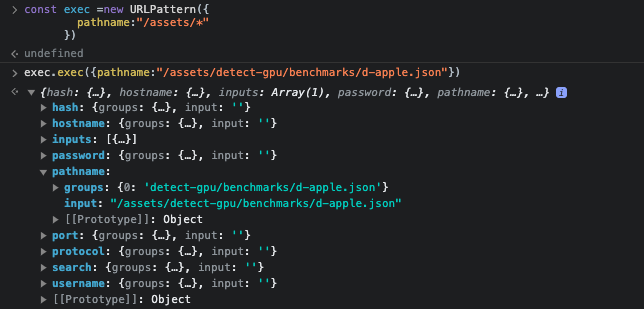

Plaoc provides redirect functionality similar to nginx, using [URLPattern](https://developer.mozilla.org/en-US/docs/Web/API/URL_Pattern_API) to parse matching paths.

### Create `plaoc.json`

First create `plaoc.json` in your project root directory, path as follows:

```bash
plaoc-app
├── ......other project files
├── manifest.json
└── plaoc.json
```

All field contents are as follows:

```json
{
  "defaultConfig": {
    "lang": "en" 
  },
  "redirect": [
    {
      "matchMethod": ["*"],
      "matchUrl": {
        "pathname": "/"
      },
      "to": {
        "url": "/locales/{{lang}}{{pattern.pathname.input}}index.html",
        "appendHeaders": {},
        "removeHeaders": []
      }
    }
  ]
}
```

The above configuration rule is:

Allow all types of Method, and when the requested pathname is `/`, it will be forwarded to the configured `to.url`.

You can see the focus of the above configuration is on 
```javascript
/locales/{{lang}}{{pattern.pathname.input}}index.html
```

The variables are stored in `{{}}`, including:

- lang corresponds to the configuration content of `defaultConfig.lang`
- pattern is the content parsed by `URLPattern`. 

The structure is as shown in the example below. Executing and testing in the browser environment is also a more reliable method.



### appendHeaders 

Add content to the request Header when forwarding.

### removeHeaders

Remove request header when forwarding

### Some example explanations

The type of redirect is an array, so you can define multiple redirects.

```json
"redirect": [
  {
    "matchMethod": ["*"],
    "matchUrl": {
      "pathname": "/"
    },
    "to": {
      "url": "/locales/{{lang}}{{pattern.pathname.input}}index.html",
      "appendHeaders": {},
      "removeHeaders": []
    }
  },
  {
    "matchMethod": ["*"], 
    "matchUrl": {
      "pathname": "{/}assets/*"
    },
    "to": {
      "url": "{{pattern.pathname.input}}",
      "appendHeaders": {},
      "removeHeaders": []
    }
  },
  {
    "matchMethod": ["*"],
    "matchUrl": {
      "pathname": "/*"
    },
    "to": {
      "url": "/locales/{{lang}}{{pattern.pathname.input}}",
      "appendHeaders": {},
      "removeHeaders": []
    }
  }
]
```

The above three redirects will match the following urls:

1. Rule is: `/`

   `/ --> /locales/en/index.html`

2. Rule is: `{/}assets/*`

   `assets/xxxx/icon.png -> assets/xxxx/icon.png`

   `/assets/xxxx/icon.png -> /assets/xxxx/icon.png` 

3. Rule is: `/*`

   `/1234124.index.js -> /locales/en/1234124.index.js`

More forwarding rules can be found in [URLPattern](https://developer.mozilla.org/en-US/docs/Web/API/URL_Pattern_API).

### Hidden usage

JS expressions can be written in `{{}}`.

```js
{{pattern.pathname.groups.assets === 'assets' ? '/'+pattern.pathname.input : '/locales/'+lang+pattern.pathname.input}}
```