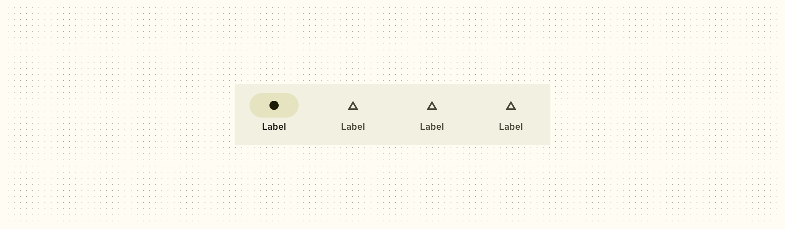
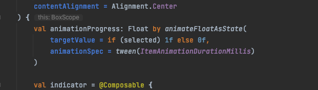

# Navigation Bar



## 组件示例

> 以vue3 为例

```vue
       <dweb-bottom-bar id="bottom_bar" background-color="#D0BCFF"  height="70" hidden="false"  overlay="0.2" >
        <dweb-bottom-bar-button id="ddd" selected  indicator-color="#D0BCFF"  >
            <dweb-bottom-bar-icon source="https://objectjson.waterbang.top/test-vue3/land.svg" un-source="https://objectjson.waterbang.top/test-vue3/land-not.svg"  type="AssetIcon"   ></dweb-bottom-bar-icon>
            <dweb-bottom-bar-text color="#938F99" selected-color="#1C1B1F"  value="土地"></dweb-bottom-bar-text>
        </dweb-bottom-bar-button>
        <dweb-bottom-bar-button id="eee"  @click="openScanner" diSelectable>
            <dweb-bottom-bar-icon source="https://objectjson.waterbang.top/test-vue3/scanner.svg" type="AssetIcon"></dweb-bottom-bar-icon>
            <dweb-bottom-bar-text  value="扫码"></dweb-bottom-bar-text>
        </dweb-bottom-bar-button>
        <dweb-bottom-bar-button id="fff" indicator-color="#D0BCFF" >
            <dweb-bottom-bar-icon source="https://objectjson.waterbang.top/test-vue3/home.svg" un-source="https://objectjson.waterbang.top/test-vue3/home-not.svg" type="AssetIcon"  ></dweb-bottom-bar-icon>
            <dweb-bottom-bar-text color="#938F99" selected-color="#1C1B1F" value="个人空间"></dweb-bottom-bar-text>
        </dweb-bottom-bar-button>
    </dweb-bottom-bar>
```

## dweb-bottom-bar

包含属性`background-color`,`foreground-color`,`hidden`, `overlay`,`height`。

### `background-color`

控制bottombar的背景颜色。

### `foreground-color`

bottombar内容的首选颜色。默认为 `background-color` 的匹配内容颜色。

### `hidden`

是否隐藏bottombar。
默认值：false。

### `overlay`

是否开启bottombar遮罩,也就是背景变透明，建议传递值`0~1`之间。
默认值：1 , 也就是不透明。

::: warning
android是用rgba控制指示器颜色的，因此如果要使用此属性，需要禁掉`indicator-color`，但是！！
android源码强制覆盖了`indicatorColor`来控制是否选中，所以这个属性是有问题的，期待解决，[how-do-hide-navigationbar-indicatorcolor](https://stackoverflow.com/questions/73566582/how-do-hide-navigationbar-indicatorcolor)。
:::



### `height`

控制bottom高度。
默认值： Android: 80 ，IOS: 88。

## dweb-bottom-bar-button

包含属性：`disabled`, `selected`, `diSelectable`, `indicator-color`。

### `disabled`

禁用所有的事件，包括无障碍事件。

### `selected`

控制是否选中。

### `diSelectable`

此属性控制bar是否可以选择，可触发事件。

### `indicator-color`

控制选中指示器的颜色。如上图4号标记。

::: warning
Android Navigation bar indicatorColor无法设置透明度。即RBGA的A无效，原因是被系统劫持,来控制是否选中。
:::

## dweb-bottom-bar-icon

包含属性：`type`, `description`, `size`, `source`,`un-source`, `color`, `selected-color`。

### `size`

控制图标大小。

### `source`

必传属性，建议传递svg格式图片，此属性存放选中显示的图片。如上图2号标记。

### `un-source`

建议传递svg格式图片,此属性存放未选中显示的图片，如果未传递则选未选中都使用`source`图片。

## dweb-bottom-bar-text

包含属性：`value`,`color`, `selected-color`, ` hide-value`。

### `value`

设置bottom bar的文字。如上图3号标记。

### `color`

未选中的文字颜色。

### `selected-color`

选中的文字颜色。

### `hide-value`

如果指定此值，则只有选中的时候才会显示文字。
