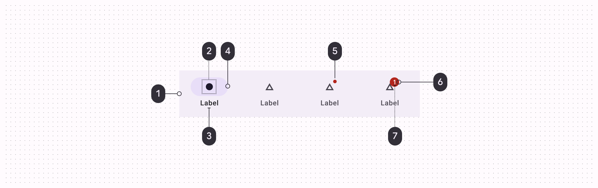

# Navigation Bar



## 组件示例

> 以vue3 为例

```vue
   <dweb-bottom-bar id="bottom_bar" background-color="#D0BCFF" indicator-color="#f3bf44" >
        <dweb-bottom-bar-button id="ddd" selected   >
            <dweb-bottom-bar-icon source="https://objectjson.waterbang.top/test-vue3/land.svg" un-source="https://objectjson.waterbang.top/test-vue3/land-not.svg"  type="AssetIcon"   ></dweb-bottom-bar-icon>
            <dweb-bottom-bar-text color="#FFD8E4" selected-color="#B3261E"  value="土地"></dweb-bottom-bar-text>
        </dweb-bottom-bar-button>
        <dweb-bottom-bar-button id="eee"  @click="openScanner" diSelectable>
            <dweb-bottom-bar-icon source="https://objectjson.waterbang.top/test-vue3/scanner.svg" type="AssetIcon"></dweb-bottom-bar-icon>
            <dweb-bottom-bar-text  value="扫码"></dweb-bottom-bar-text>
        </dweb-bottom-bar-button>
        <dweb-bottom-bar-button id="fff" >
            <dweb-bottom-bar-icon source="https://objectjson.waterbang.top/test-vue3/home.svg" un-source="https://objectjson.waterbang.top/test-vue3/home-not.svg" type="AssetIcon"  ></dweb-bottom-bar-icon>
            <dweb-bottom-bar-text color="#FFD8E4" selected-color="#B3261E" value="个人空间"></dweb-bottom-bar-text>
        </dweb-bottom-bar-button>
    </dweb-bottom-bar>
```

## dweb-bottom-bar

包含属性`background-color`,`indicator-color`,`hidden`, `overlay`,`height`。

### `background-color`

控制navigationBar的背景颜色。

### `indicator-color`

控制选中指示器的颜色。

## dweb-bottom-bar-button

包含属性：`disabled`, `selected`, `selectable`, `indicator-color`。

### selected

控制是否选中

## dweb-bottom-bar-icon

包含属性：`type`, `description`, `size`, `source`,`un-source`, `color`, `selected-color`。

## dweb-bottom-bar-text

包含属性：`value`,`color`, `selected-color`。
