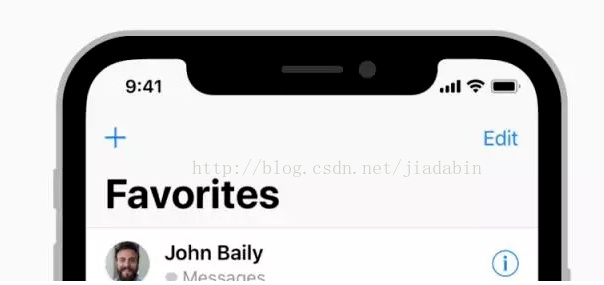

DOMInsets 接口是一个用来描述，某个元素在屏幕设备中所占据的位置信息；
例如： 下图中刘海屏中，系统状态栏占据了屏幕顶部的部分区域；所以 `StatusPlugin.state.currentState.insets.top`的值等于系统状态栏的高度；
根据 插件的不同之也会不同

## 属性

- DOMInsets.top
  
  值是一个 number;
  用来描述 某个元素在屏幕设备中顶部所占据的位置信息；
  例如： 系统状态栏 status-bar 会占据屏幕设备顶部的部分区域，如果 status-bar 的高度是 48px;那么 DOMInsets.top === 48;

- DOMInsets.right
  
  值是一个 number;
  用来描述 某个元素在屏幕设备中右侧所占据的位置信息；
  原理同 DOMInsets.top 只是元素占据的位置不同；

- DOMInsets.bottom
  
  值是一个 number;
  用来描述 某个元素在屏幕设备中底部所占据的位置信息；
  原理同 DOMInsets.top 只是元素占据的位置不同；

  

- DOMInsets.left
  
  值是一个 number;
  用来描述 某个元素在屏幕设备中左侧所占据的位置信息；
  原理同 DOMInsets.top 只是元素占据的位置不同；

## 方法
- 无

## 事件
- 无

## 平台兼容性

| 属性/方法/事件 | Android | IOS | Desktop-Dev | Desktop |
|:------------:|:-------:|:---:|:-----------:|:-------:|
| top          | ✅      | ✅  | ✅          | X       |
| right        | ✅      | ✅  | ✅          | X       |
| bottom       | ✅      | ✅  | ✅          | X       |
| left         | ✅      | ✅  | ✅          | X       |

## 相关链接

[State]("../state/index.md)

[StateObserver](../state-observer/index.md)
