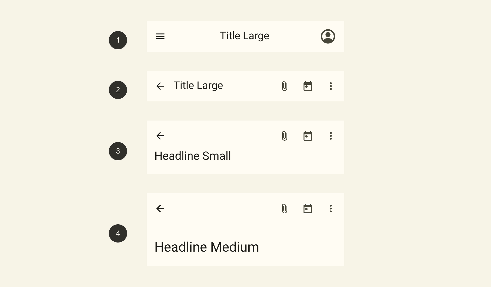

<p align="center">
  
</p>

## example

> 以vue3 为例,完整代码查看:[test-vue3](https://github.com/BioforestChain/dweb_browser/tree/main/plugins/demo)

```html
   <dweb-top-bar id="topbar" title="Ar 扫雷" background-color="#eeee" foreground-color="#000"  overlay="0.4" >
        <dweb-top-bar-button id="aaa">
            <dweb-icon source="Filled.AddCircle" ></dweb-icon>
        </dweb-top-bar-button>
        <dweb-top-bar-button id="ccc">
            <dweb-icon source="https://objectjson.waterbang.top/test-vue3/vite.svg" type="AssetIcon"></dweb-icon>
        </dweb-top-bar-button>
    </dweb-top-bar>
```

## dweb-top-bar

包含属性`background-color`,`foreground-color`,`hidden`, `overlay`,`title`。

### `title`

控制主标题。

### `background-color`

控制`topBar`的背景颜色。

### `foreground-color`

`topBar`内容的首选颜色。控制返回键，标题，内置icon的颜色。

> 或许应该再给几个属性？ `icon-color`,`title-color`,`back-color`

### `overlay`

是否开启`topBar`遮罩,也就是背景变透明，建议传递值`0~1`之间。
默认值：1 , 也就是不透明。

## dweb-top-bar-button

包含属性:`disabled`。`hidden`(还没写,要不要这个属性嘞？)

> 点击下拉菜单？

### `disabled`

禁止触发所有事件，包括无障碍事件。但是还是看得见。

## dweb-icon

包含属性：`type`, `description`, `size`, `source`。

### `source`

建议传递svg格式图片，注意如果使用自定义图片则无法定义其颜色。

### `type`

设置icon的类型，如果要传递自定义图片，`Android`需要指定 `type="AssetIcon"`。

### `description`

无障碍服务用来描述这个图标代表什么的文本。(⚠️ 未测试)

### `size`

控制图标大小。


## Methods​

> platform为空就是同时支持ios/android/dasktop 平台

| API                                     | platform | return:Promise | 解释                       |
|-----------------------------------------|----------|----------------|--------------------------|
| topBarNavigationBack()                  |          | boolean        | 返回上一级                 |
| setTopBarShow(isShow: boolean)          |          | boolean        | 设置topbar隐藏或显示       |
| getTopBarShow()                         |          | boolean        | 获取topbar隐藏或显示的状态 |
| getTopBarTitle()                        |          | string         | 获取标题名称               |
| setTopBarTitle(title: string)           |          | boolean        | 设置标题名称               |
| hasTopBarTitle()                        |          | boolean        | 查看是否设置了标题         |
| getTopBarAlpha()                        |          | number         | 获取状态栏的透明度         |
| setTopBarAlpha(alpha: string)()         |          | boolean        | 设置状态栏的透明度         |
| getTopBarHeight()                       |          | number         | 获取状态栏高度             |
| getTopBarBackgroundColor()              |          | string         | 获取状态栏背景颜色         |
| setTopBarBackgroundColor(color: string) |          | boolean        | 设置状态栏背景颜色         |
| getTopBarForegroundColor()              |          | string         | 获取状态栏文字和图标颜色   |
| setTopBarForegroundColor(color: string) |          | boolean        | 设置状态栏文字和图标颜色   |
