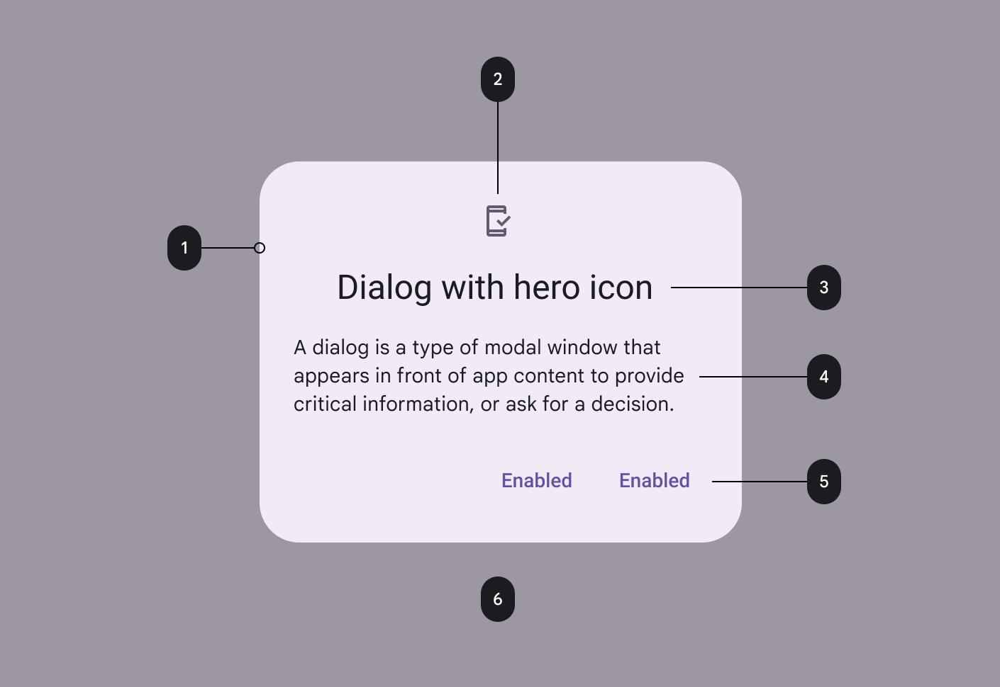

# Dialogs

<p align="center">
  
</p>

## example

> 以vue3 为例,完整代码查看:[test-vue3](https://github.com/BioforestChain/dweb_browser/tree/main/plugins/demo)

```html
  <dweb-dialog-alert :visible="visable.alert" title="810975" content="密码忘了怎么办？" disOnClickOutside disOnBackPress>
    <dweb-dialog-button @click="visable.alert = false">确定</dweb-dialog-button>
  </dweb-dialog-alert>
  <dweb-dialog-prompt :visible="visable.prompt" title="prompt" label="我是提示文案" defaultValue="扣1送火麒麟" disOnClickOutside disOnBackPress>
    <dweb-dialog-button @click="visable.prompt = false" aria-label="cancel">拒绝</dweb-dialog-button>
    <dweb-dialog-button @click="visable.prompt = false" aria-label="confirm">11111111</dweb-dialog-button>
  </dweb-dialog-prompt>
  <dweb-dialog-confirm :visible="visable.confirm" title="confirm" message="南水北调" disOnClickOutside disOnBackPress>
    <dweb-dialog-button @click="visable.confirm = false" aria-label="cancel">No</dweb-dialog-button>
    <dweb-dialog-button @click="visable.confirm = false" aria-label="confirm">ok</dweb-dialog-button>
  </dweb-dialog-confirm>
  <dweb-dialog-warring :visible="visable.warring" title="FBI Warring" message="FBI open the door">
    <dweb-dialog-button @click="visable.warring = false" aria-label="cancel">No</dweb-dialog-button>
    <dweb-dialog-button @click="visable.warring = false" aria-label="confirm">ok</dweb-dialog-button>
  </dweb-dialog-warring>
```

::: tip
以下4个弹窗组件都由`visible`属性控制显示隐藏。传递true为显示，false为隐藏。
:::

## dweb-dialog-alert

一个弹窗效果。包含属性：`title`,`content`,`disOnClickOutside`,`disOnBackPress`

### `title`

提示弹窗标题。

### `content`

提示弹窗提示内容。

### `disOnBackPress`

是否可以通过按下后退按钮来关闭对话框。

### `disOnClickOutside`

是否可以通过在对话框边界之外单击来关闭对话框。

### dweb-dialog-button

作为子节点存在，点击alert弹窗将触发这里的click事件，因此可以在这里绑定关闭事件。

## dweb-dialog-prompt

一个包含input编辑框的弹窗。包含属性：`title`,`label`,`defaultValue`,`disOnClickOutside`,`disOnBackPress`。

### `title`

编辑框弹窗标题。

### `label`

input编辑框的提示文本。

### `disOnBackPress`

是否可以通过按下后退按钮来关闭对话框。

### `disOnClickOutside`

是否可以通过在对话框边界之外单击来关闭对话框。

### dweb-dialog-button

作为子节点存在，点击弹窗按钮将触发这里对应的click事件，因此可以在这里绑定关闭事件。

包含属性：`aria-label`。

该属性传递：`cancel`,`confirm`两个关键字，对应点击拒绝或者确定。

## dweb-dialog-confirm / dweb-dialog-warring

询问提示框和告警提示框。

包含属性：包含属性：`title`,`message`,`disOnClickOutside`,`disOnBackPress`。

### `title`

提示框弹窗标题。

### `message`

提示框内容文本。

### `disOnBackPress`

是否可以通过按下后退按钮来关闭对话框。

### `disOnClickOutside`

是否可以通过在对话框边界之外单击来关闭对话框。

### dweb-dialog-button

作为子节点存在，点击弹窗按钮将触发这里对应的click事件，因此可以在这里绑定关闭事件。

包含属性：`aria-label`。

该属性传递：`cancel`,`confirm`两个关键字，对应点击拒绝或者确定。


